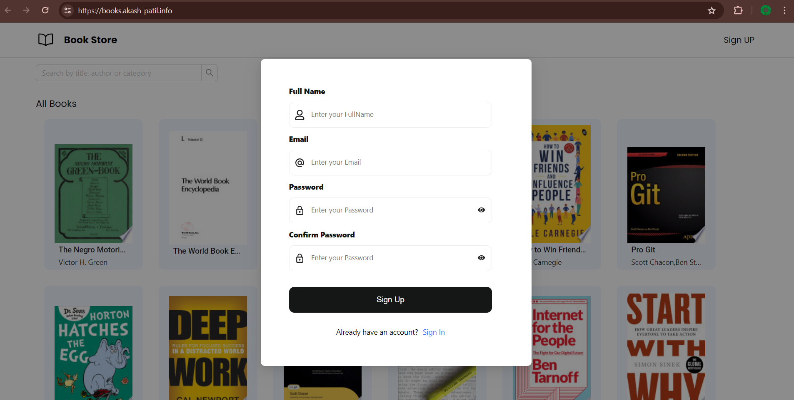
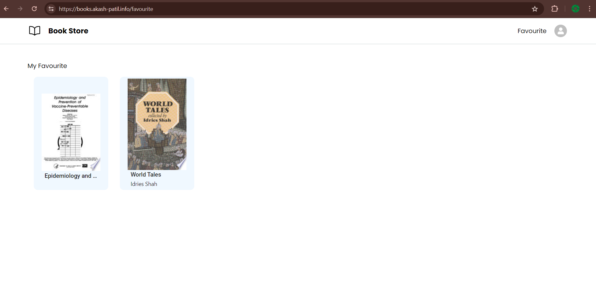

# Book Store

## Description

This is Book Store application built using React. It allows user to read the book, user can add book to favourite list and mark as read as well. It gives the recommandation of books according to the user activities.

## Features

- Create multiple accounts and maintain their favourite list.
- Read the books.
- Mark as read after reading the books.
- User can create account and signin.
- Auto recommandation of books according to users search history, read history and favourite list.

## Website link

[Website Link](https://books.akash-patil.info)

## Test Credentials

- Email : `test@example.com`
- Password: `Test@12345`

## Book API
  
Used [Google Book API](https://developers.google.com/books/docs/overview)

## Folder Structure

- `src/`: Contains the source code of the application.
  - `components/`: Reusable UI components.
  - `utils/`: Utility functions, Redux store, and routes.
    - `store/`: Contains the Redux store and all slices.
    - `routes.jsx`: Contains all routes.
  - `pages/`: All the pages/screens are stored here.
  - `services/`: Request middleware is stored here.
- `App.jsx`: Entry point of the application.

## Requirements <!-- Requirements -->

- Nodejs
- Packages listed in `package.json`


## Technology Used

- ReactJS

## Packages Used

- **axios**: A promise-based HTTP client for the browser and Node.js, used to send request to backend.
- **dotenv**: A module that loads environment variables from a `.env` file into `process.env`, helping to manage configuration.
- **antd**: Provides inbuilt UI components.
- **react-icons**: For various icons.
- **react-redux**: For managing the state with Redux.
- **react-router-dom**: For managing routes in a React application.


## Installation <!-- Installation -->

1. Clone the repository:

   ```bash
   git clone <repository_url>

   ```

2. Go to the project

   ```bash
   cd ebooks

   ```

3. Install Dependencies:
   ```bash
   npm install
   ```

## Usage <!-- Usage -->

1.  start project
    ```bash
    npm run dev
    ```


## Deployment

### Technology Used

- **AWS EC2**: Amazon Web Services Elastic Compute Cloud (EC2) is used to deploy the server.
- **Nginx**: Nginx is a high-performance web server and reverse proxy server. It is used to serve the website, handle load balancing, and manage incoming HTTP requests efficiently.


## Screenshots


### Home Page


### Registration Page


### SignIn Page


### Favourite Page (My List)
